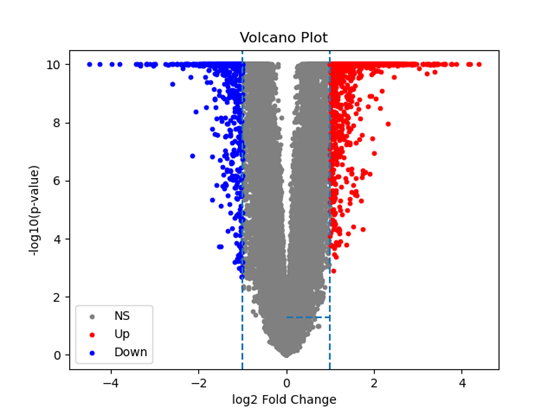

# Volcano Plot
[TOC]

## 1. 算法介绍

   * **背景与目标**
     火山图（Volcano Plot）是基因表达差异分析中常用的可视化工具，用于同时展示每个基因的**表达倍数变化**（fold change）和**统计显著性**（p 值或 FDR）。核心目标是：

     > 在同一视图中，一眼识别出既具有大幅度表达变化又具有高显著性的差异表达基因（DEG）。

   * **应用场景**

     * RNA-seq、微阵列差异表达分析结果的直观展示
     * DESeq2、edgeR、limma 等工具输出结果的二次可视化
     * 快速筛选生物学上感兴趣的候选基因

   * **核心思路**

     1. **横坐标**：基因的对数表达倍数变化 $\log_2\mathrm{FC}$；
     2. **纵坐标**：基因的显著性度量 $-\log_{10}(\mathrm{FDR})$ 或 $-\log_{10}(p)$；
     3. 根据预设阈值（如 $|\log_2\mathrm{FC}|\ge1$ 且 $\mathrm{FDR}\le0.05$）对基因进行着色或标注，绘制水平和垂直参考线。

---

## 2. 公式及原理

   **2.1 对数倍数变化（log₂FC）**
   给定实验组（组2）和对照组（组1）在某基因上的平均表达值 $\bar{x}_2$、$\bar{x}_1$，计算

   $$
     \mathrm{FC} = \frac{\bar{x}_2}{\bar{x}_1},  
     \quad
     \log_2\mathrm{FC} = \log_2\!\bigl(\mathrm{FC}\bigr).
   $$

   **2.2 显著性转换**
   对每个基因取 FDR 调整后 p 值 $q$，转换为

   $$
     S = -\log_{10}(q).
   $$

   这样 $S$ 越大表示越显著。

   **2.3 差异基因阈值**
   设定折叠变化阈值 $\tau_{\mathrm{FC}}$ 和显著性阈值 $\tau_{\mathrm{FDR}}$：

   $$
     |\log_2\mathrm{FC}| \ge \tau_{\mathrm{FC}},
     \quad
     q \le \tau_{\mathrm{FDR}}
     \;\Longleftrightarrow\;
     S \ge -\log_{10}(\tau_{\mathrm{FDR}}).
   $$

   在火山图中，通常绘制：

   * 垂直参考线：$x=\pm \tau_{\mathrm{FC}}$；
   * 水平参考线：$y=-\log_{10}(\tau_{\mathrm{FDR}})$。

---

## 3. 伪代码

```text
# 输入
#   genes: 基因列表，长度 n
#   mean1[i], mean2[i]: 对照组和实验组第 i 个基因的平均表达
#   q[i]: 第 i 个基因的 FDR 调整后 p 值
#   tau_fc: log2FC 阈值（如 1）
#   tau_fdr: FDR 阈值（如 0.05）
# 输出
#   用于绘图的数据点 (x[i], y[i], color[i])

function VolcanoPlotData(genes, mean1, mean2, q, tau_fc, tau_fdr):
    n ← length(genes)
    x, y, color ← arrays of length n

    for i in 1…n:
        # 1) 计算 log2FC
        fc ← mean2[i] / mean1[i]
        x[i] ← log2(fc)

        # 2) 计算显著性度量
        y[i] ← -log10(q[i])

        # 3) 根据阈值分类
        if |x[i]| ≥ tau_fc and q[i] ≤ tau_fdr:
            if x[i] > 0:
                color[i] ← "up"    # 上调基因
            else:
                color[i] ← "down"  # 下调基因
        else:
            color[i] ← "ns"       # 非显著

    # 4) 返回散点图数据，可用于绘制
    return x, y, color

# 绘制步骤（伪）
#   scatter(x, y, color)
#   draw_vertical_line(x=+tau_fc), draw_vertical_line(x=-tau_fc)
#   draw_horizontal_line(y=-log10(tau_fdr))
#   annotate_top_genes(...)
```

* **时间复杂度**：$O(n)$
* **可视化要点**：

  * 点的大小或透明度可编码表达量或基因密度；
  * 可以选择突出展示显著基因的标签；
  * 配色要兼顾可读性与信息传达。

---

## 4. 示例

